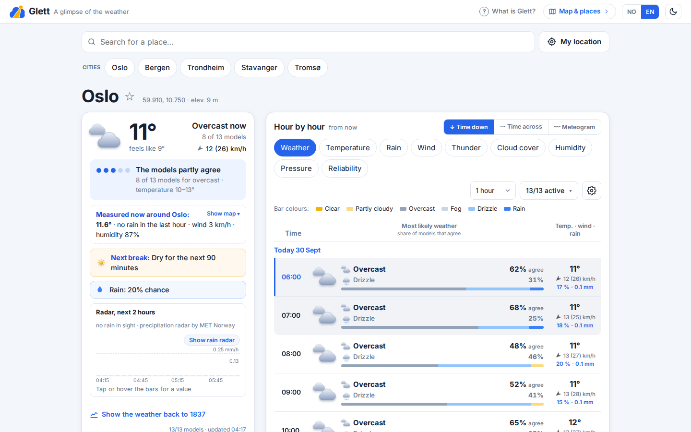
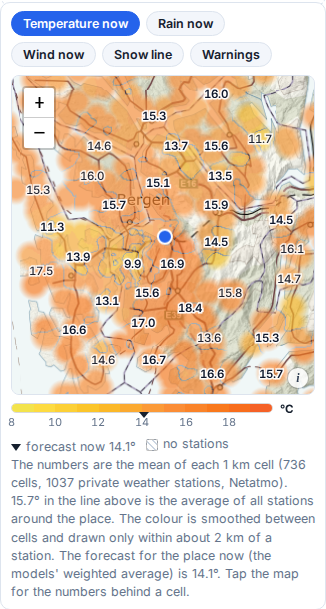
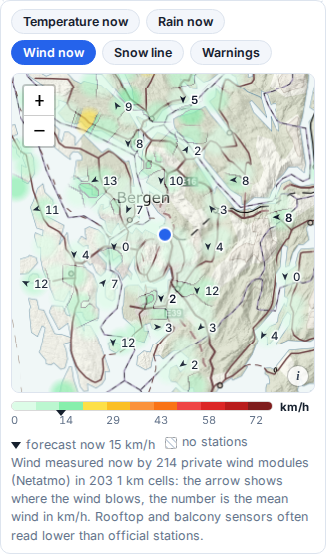
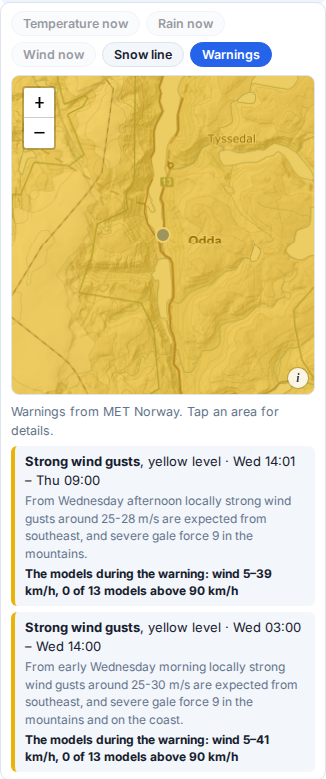
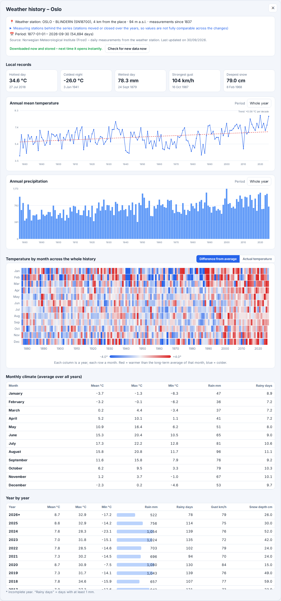
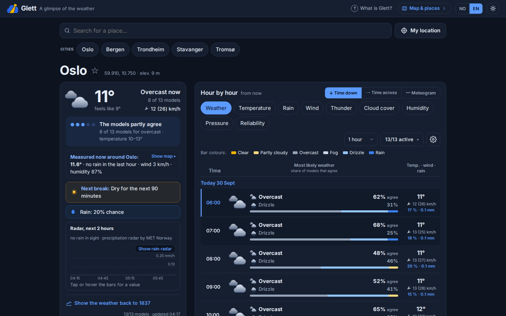
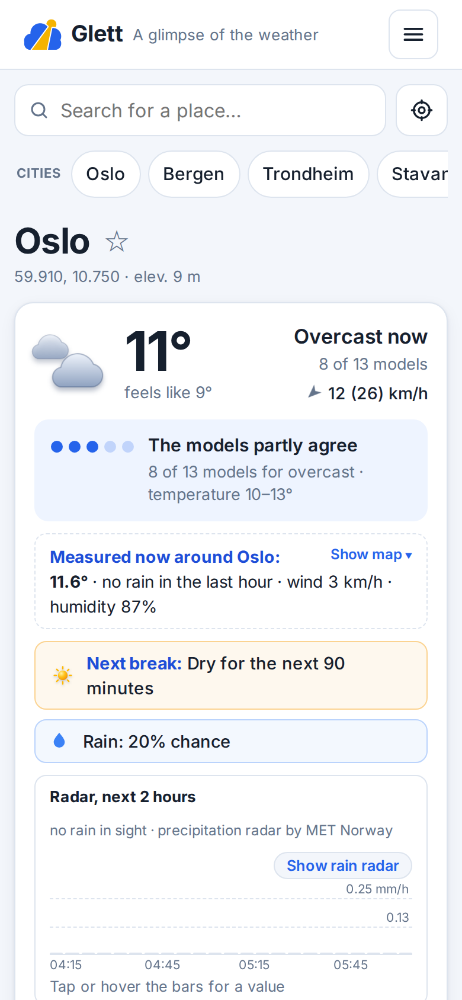
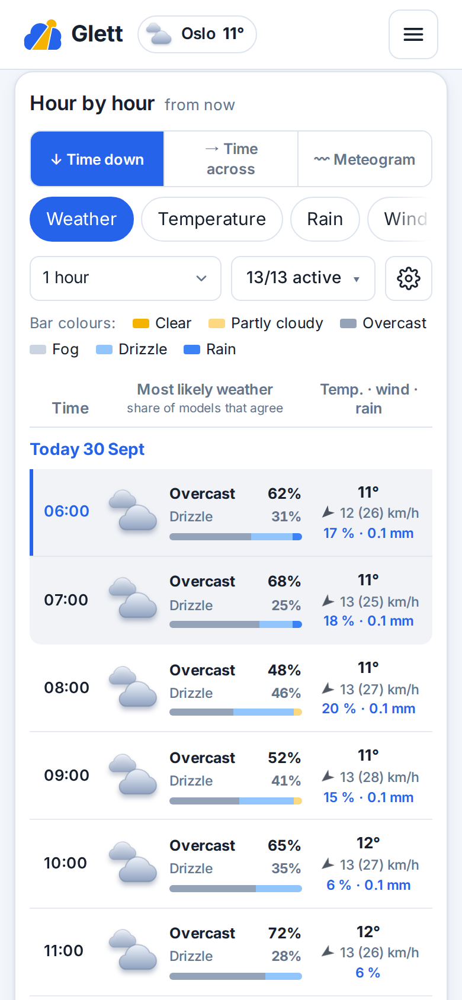

# Glett – a glimpse of the weather

**Glett** (Norwegian for a break in the clouds, live at [glett.no](https://glett.no)) is a small, free web app that puts the forecasts of many **free** weather models side by side, hour by hour, and adds a final row with a **probability derived from how much the models agree** (optionally weighted by how reliable each model has recently been for your location).
> **Credit and licence.** Glett is a fork of [weather_forecast](https://github.com/santonoreg/weather_forecast) by [@santonoreg](https://github.com/santonoreg), who came up with the idea of showing the weather models side by side with their agreement. The original is released under the [MIT License](LICENSE) (© 2026 Spyros Antonopoulos). Glett's own changes are by Haugan Media Group and are released under the same MIT License.


- Runs on **cheap shared hosting**: plain **HTML / CSS / JavaScript** (no build step) plus two tiny **PHP 8** endpoints backed by **MySQL** (no framework, no Composer)
- The heavy lifting happens **in the visitor's browser**: forecasts, verification and history are fetched from Open-Meteo and MET Norway directly and cached in IndexedDB, so every visitor uses their own API quota and the server stays idle
- Saved locations live **only in the browser** (with JSON export / import); the server stores no user data at all
- [Leaflet](https://leafletjs.com/) map with **Kartverket** topographic tiles (Norway) and OpenStreetMap as the worldwide layer; Leaflet and the Inter font are self-hosted (no CDN, no Google Fonts)
- UI languages: **Norwegian bokmål** and **English**, chosen from the browser's language settings (Norwegian for `nb`/`nn`/`no`, English otherwise) – the `NO | EN` buttons in the header override it
- Landing page shows a forecast at once (Oslo on the first visit, the last viewed place afterwards): a search field, a *Min posisjon* button, place chips (your starred places, the last five searches, the five predefined cities Oslo, Bergen, Trondheim, Stavanger, Tromsø), then a **"now" card** with the place name, current temperature, most likely weather with the share of models behind it, wind, the radar nowcast and rain summary, and the Historikk button. On desktop the now card and the *Dagene fremover* list sit in the left column with the hour views on the right
- The *Most likely weather* probability row comes **first** in every table; the individual model rows sit behind a *Show all models* toggle (collapsed by default on phones)
- The **now card** also states the verdict in words with a five-dot confidence scale ("Modellene er enige · 13 av 13 modeller for klarvær · temperatur 6–10°"), every hour row carries a **segmented agreement bar** (how the models split by weather type), and a collapsed **"Se hva modellene sier"** section under the table draws all 13 models as thin lines under Glett's bold weighted line (temperature, 48 h) plus rain bars, so disagreement is visible as line spread
- The hour table has three views, switched right above it (*↓ Tid nedover / → Tid bortover / Meteogram*). **Meteogram**: the yr-style chart per day (icon row with agreement %, temperature curve with the min–max spread band, rain bars with the wettest model behind, wind arrows with m/s and gusts). **Time downwards** (default on phones): one row per hour, the probability and average as the first columns, a rolling window of the next 24 hours from now that grows automatically as you scroll (or with *Vis 24 timer til*), a *Viser til …* footer with *Til toppen*; a day row restarts the list at that day. **Time sideways** (default on desktop): one continuous strip for the whole week with day headers; scroll past 23:00 and tomorrow follows, day rows jump, and the highlighted day follows the scroll
- **Historikk** in the toolbar opens the daily history (records, climate, heatmap, year by year) for the place currently shown; it is also available per saved place under *Kart og steder*. For places in Norway the whole station record is loaded (Blindern since 1937, Tromsø since 1920), newest years first so the page renders while older decades arrive
- The now card also shows **"Målt nå i nærheten"**: a robust average (median, outliers dropped, at least five stations) of the publicly shared private Netatmo weather stations around the place, with the model consensus difference. The bounding box grows from ±0.1° to ±0.5° until enough stations report. Needs a Netatmo developer app (`netatmo_client_id`, `netatmo_client_secret`, `netatmo_refresh_token`, scope `read_station`); the server refreshes the token itself and keeps the rotated refresh token in MySQL (`kv` table). Every fetch also stores one hourly snapshot per 0.05° cell in `obs_local`, Glett's own local observation series
- Norwegian places use **MET Norway's Frost API** (real daily measurements from the nearest long-running weather station, via `api/frost.php` with a server-side client ID and MySQL cache, no Open-Meteo quota involved); elsewhere, or without a Frost client ID, the ERA5 reanalysis via Open-Meteo is used, where the first load covers 1991 to today and *Last ned hele historikken* extends it back to 1940 (a full ERA5 series costs about a quarter of a visitor's hourly Open-Meteo allowance)
- **Local map** inside the now card (tap the *Målt nå* line): five layers on a Leaflet map around the place, one measured layer at a time. **Temperatur nå** draws the public Netatmo stations, averaged per 1 km cell (no station ids), as a continuous temperature field: inverse-distance interpolation on a 100 m grid, a fixed absolute colour scale in 1 °C classes with hairline isotherms and a heavy 0 °C line, painted only within about 2 km of a station, with the cell means as numbers on the map (thinned so they never overlap), a legend bar with the forecast marked, a tap readout, and a sentence about inversions (warmer higher up than in the lowland); the grid follows the view and more station cells are fetched as the map is panned or zoomed out. **Nedbør nå** and **Vind nå** draw the same stations' rain gauges (mm in the last hour) and wind modules (mean wind with an arrow for the direction, gusts in the readout) with the same engine. **Snøgrense** shades the terrain white where every model's snow line (0 °C level minus 200 m) lies below the ground and light blue where only some do, with an hour slider for the next two days; it costs one small Open-Meteo request (5 models) plus four elevation requests that are stored for good per area. **Farevarsler** draws MET Norway's warning polygons (via `api/alerts.php`, cached 10 minutes site-wide) and, for a place inside a warning, puts the model split next to it ("vind 8–15 m/s, 0 av 13 modeller over 17 m/s"); the most serious warning also appears as a line in the summary strip
- **Rain radar map** under the radar strip (button *Vis nedbørradar* in the strip, or the *Nedbør i nærheten* line): in the Nordic area it is MET Norway's own 1 km composite, a frame every 5 minutes for the last hour, served as WMS tiles straight from [thredds.met.no](https://thredds.met.no/) (the same product Yr draws), followed by MET's radar nowcast from the newest 5-minute issue, +5 to +90 minutes, marked with a dashed badge; elsewhere it is [RainViewer](https://www.rainviewer.com/)'s 10-minute composite. Frames are stacked tile layers switched by opacity with a play button, a slider and a time badge; nothing is interpolated or extrapolated. MET's 90-minute nowcast for the place is one pill on the map and the strip above it
- A short summary strip answers the practical questions (rain from when, strong gusts, and a **radar nowcast** from MET Norway telling when rain starts or stops in the next 90 minutes – the "neste glett")
- Wind in **m/s** (km/h can be chosen in the settings popover), large weather icons are subtly animated (off with *prefers-reduced-motion*)
- **Light / dark theme** – follows your system setting; use the sun/moon button next to the language switch to override it
- Free, no ads, no API keys, no accounts, no cookies

> The probabilities are a measure of model agreement. They are **not** an official forecast and must not be used for safety-critical decisions.

---

## Screenshots

**Forecast** – the now card with Glett's verdict, the *Measured now* line, the summary strip and the radar strip on the left, the hour table on the right (Oslo, English UI)



**Temperature map** – public Netatmo stations as a continuous field with the cell means as numbers, isotherms, and the forecast marked on the legend (Bergen); the same map has rain, wind, snow-line and warnings layers



**Wind map** and **warnings** – wind modules with arrows and speeds; MET Norway's warning polygons with the model split for the place

<p>
  
  &nbsp;
  
</p>

**Weather history** – the whole station record for a place in Norway (Oslo-Blindern since 1837 through its predecessor stations): records, annual charts, the month-by-year heatmap, monthly climate and year by year



**Dark theme** and **phone layout**



<p>
  
  &nbsp;
  
</p>

---


## Table of contents

1. [Screenshots](#screenshots)
2. [What it shows](#what-it-shows)
3. [How it works](#how-it-works)
4. [Architecture](#architecture)
5. [Requirements](#requirements)
6. [Installation on shared hosting](#installation-on-shared-hosting)
7. [Local test copy with Docker](#local-test-copy-with-docker)
8. [Configuration](#configuration)
9. [Project structure](#project-structure)
10. [HTTP API](#http-api)
11. [Data, privacy and external services](#data-privacy-and-external-services)
12. [Limitations](#limitations)
13. [Adding a language](#adding-a-language)
14. [Troubleshooting](#troubleshooting)

---

## What it shows

### Places and map (*Kart og steder*)

- The landing page shows a forecast at once: Oslo on the first visit, the last viewed place afterwards. Search by name, use **Min posisjon**, or tap a place chip (your starred places, the last five searches, five predefined cities).
- The *Kart og steder* page has the full map: pick a place by **clicking on the map**, typing **latitude/longitude** or searching; the name is filled in automatically (reverse geocoding) and can be edited.
- **Save** a place (the star): it is stored **in your browser** (IndexedDB) and appears as a chip. Saved places are shown on the map and can be deleted; **Export / Import** moves the list to another device as a small JSON file.
- **Vis været tilbake til …** in the now card (and the *History* button next to every saved place) opens the long-term weather history for that place (see below).

### Driving weather (*Kjørevær*)

- **Kjørevær** in the menu: the weather along a driving route, at the time you will be at each point. A → B (plus up to three via points), car or motorcycle, departure now or up to three days ahead (Norway for now).
- **Routes:** Statens vegvesen's route planner (Ruteplantjeneste v3) through `api/route.php` when it is configured (it needs a username and password; free with attribution, 2500 calls/day), otherwise [Valhalla](https://github.com/valhalla/valhalla) on the FOSSGIS server straight from the browser. Up to three alternatives, with the road's own heights along them (Kartverket's height API as the fallback in Norway).
- **Weather:** a sample every 10 minutes of driving or 20 km and at every mountain-pass top, all fetched in **one Open-Meteo multi-location request**, at the real height. Similar weather is grouped into driver classes (dry, fog, rain incl. drizzle, heavy rain, sleet, snow, freezing rain, thunder); badges for temperatures crossing 0 °C (±1 °C hysteresis), *mulig glatt* (air ≤ +3 °C with precipitation or a damp clear night), drifting snow, gusts (20 m/s car, 13 m/s motorcycle), darkness and MET warnings on the route. Snow and ice slow the expected pace, which moves the later samples.
- **Compare:** route cards with a mini weather ribbon and a sentence on why; *Når bør du kjøre?* scores every departure hour for the next 72 hours; the chart shows the weather band, air temperature with the 0 °C line and the height profile, synced with the map.
- **Options:** *Unngå ferjer* (Valhalla `use_ferry: 0`, Vegvesen `AvoidRoadFeatureTypes=Ferge`), *Unngå mørkekjøring* (darkness weighs heavily in the scoring and the departure strip, no new route needed) and, on a motorcycle, *Svingete veier* (Valhalla's motorcycle costing off motorways; every motorcycle route shows how bendy it is in degrees of turning per km). Route options grey out the result until *Finn ruter* is pressed; nothing is calculated on a change by itself.
- **Map:** MapLibre with the shadow map's 2D / 3D button (terrain at 1.5×), Leaflet where WebGL is missing; *Større kart* moves the map and the chart to the top together and sizes the map so both are fully visible.
- **No turn-by-turn:** a road-number itinerary (E 16, Rv 7, …) with clock times and the weather per stage, mountain passes with a link to Vegvesen's traffic page, GPX export, a share link (`#kv?a=…&b=…&o=…`) and *Åpne i:* Google Maps (up to 8 via points, 3 on phones), Apple Maps (Apple devices only; via points from iOS 18.4 / macOS 15.4) and Waze (destination only). The links open the installed app on a phone.
- **Saved routes** stay in the browser (`localStorage`) and travel with the places in export / import.
- Expandable by design: `KV_ROUTERS`, `KV_REGIONS` and `KV_PROFILES` in `js/route.js` (a new region, a router such as a curvy-road motorcycle service, or a vehicle profile is a registry entry).

### Location history

The history section shows what the weather has been like at a place since **1940** (ERA5), or since the nearest MET Norway station started measuring for places in Norway (Oslo-Blindern 1837 through its predecessor stations, Tromsø 1920):

- **Coverage:** which data grid point was used (its coordinates, its distance from your location and its elevation), the period and the number of days available.
- **Records:** hottest day, coldest night, wettest day, strongest gust, snowiest day, with dates.
- **Charts (full width):** *Annual mean temperature* (with a trend line in °C per decade) and *Annual precipitation*. Each chart has its own **Period** drop-down: *Whole year* shows the annual value, while choosing a month (e.g. *January*) shows the mean temperature – or the total rainfall – of that month for every year in the history.
- **Temperature heatmap:** one cell for every month of every year since 1940 (columns = years, rows = months). By default the colour is the **difference from that month's long-term average** (red warmer, blue colder), so you can see at once how every month has changed over the whole history; a switch shows the actual temperature instead.
- **Monthly climate:** average temperature (mean / max / min), rainfall and rainy days for each month over all years.
- **Year by year:** mean / max / min temperature, precipitation (with bars), rainy days (≥ 1 mm), strongest gust and snowfall.

Outside Norway, the first time you open it the app downloads the complete daily series (about 1.5 MB, a few seconds) from the Open-Meteo Historical Weather API for the grid point **nearest to the coordinates** (ERA5 / ERA5-Land reanalysis, ~10 km resolution) and **stores it in your browser** (IndexedDB, keyed by the data grid point so nearby places share one series). Every later visit is served from the browser storage in a fraction of a second, and **only the days that are not stored yet are downloaded and appended** (checked at most once every 6 hours, or immediately with *Check for new data now*). Deleting a location also deletes its stored history. Note that this is a reanalysis (a model constrained by observations), not station measurements.

### Forecast

The forecast page is built around three cards:

1. **The now card**: current temperature and feels-like, the most likely weather with the share of models behind it, wind and gusts, a five-dot verdict on how much the models agree, the *Målt nå* line (public Netatmo stations, see below), the summary strip (rain from when, strong gusts, MET warning, the radar *Neste glett* line), the *Radar neste 2 timer* strip and the local maps.
2. **Dagene fremover** (7 days, one aligned row each): most likely weather icon, expected high / low, chance of rain with the amount, strongest gust and, when relevant, chance of thunderstorm. Tap a day to see it hour by hour.
3. **Time for time**: the hour table in three views (*Tid nedover*, *Tid bortover*, *Meteogram*) with one tab per parameter. Every tab shows Glett's own answer first and the individual models behind a *Vis alle modeller* toggle:

   | Tab | Provider cells | Summary row | **Glett's row (probability)** |
   |---|---|---|---|
   | **Vær** (weather) | weather icon + temperature | average temperature | every weather category predicted by the models with its share, a segmented agreement bar, the top one as a large icon |
   | **Temperatur** | °C, colour-coded | average, min–max | agreement % and ± standard deviation |
   | **Nedbør** (rain) | mm per step | average, max | chance of rain (share of models giving ≥ 0.2 mm in the step) |
   | **Vind** | 10 m speed, arrow = direction the wind blows towards, gust in brackets | average and range, mean direction | chance of strong wind (share of models ≥ 30 km/h) and of gusts ≥ 60 km/h |
   | **Torden** | CAPE (J/kg) and a bolt when the model forecasts a thunderstorm | average CAPE | chance of thunderstorm |
   | **Skydekke / Fuktighet / Lufttrykk** | value, colour-coded | average, min–max | agreement % |
   | **Pålitelighet** | see [Model verification](#model-verification-reliability-tab) | | |

   **Step**: 1, 3, 6 or 12 hours (rain = sum, gust/CAPE = max, weather code = most severe, wind direction = speed-weighted circular mean, others = mean). The current hour is highlighted and past hours are dimmed. The models drop-down enables or disables individual models, the settings popover switches the wind unit and the reliability weighting, and *Se hva modellene sier* under the table draws all models as thin lines under Glett's weighted line.

### Models drop-down

- Each model has a checkbox, a short note about **which regions it is best for**, and its reliability score (0–100) once verification has loaded.
- Disabled models disappear from the tables and from all averages and probabilities. At least one model must stay enabled.
- The choice is **per browser** (saved in `localStorage`, see [privacy](#data-privacy-and-external-services)) and applies to all locations.
- Models that cannot cover the selected location are listed under *No coverage for this location*.
- Some regional models (KNMI, DMI, MET Norway Nordic) silently return a **copy of a global model** outside their domain. Glett detects identical series and counts them **only once**; they are shown greyed out with the note *Same data as …*.

---


## How it works

### Data sources

| Provider | How it is fetched |
|---|---|
| **ECMWF AIFS** (AI / neural-network forecast), ECMWF IFS, NOAA GFS, DWD ICON, Environment Canada GEM, Météo-France, UK Met Office, JMA, CMA GRAPES, BOM ACCESS, KNMI, DMI, MET Norway Nordic | one request **from the browser** to the [Open-Meteo forecast API](https://open-meteo.com/) with the `models=` parameter |
| MET Norway / Yr (global) | **from the browser**, directly from the [MET Norway Locationforecast API](https://api.met.no/) (converted to the same hourly format) |

Real observations used only for the reliability score come from [aviationweather.gov](https://aviationweather.gov/data/api/) (METAR); that API does not allow browser requests, so the server fetches and caches them (`api/metar.php`). Models that return no data for the location are dropped automatically. **ECMWF AIFS** is ECMWF's newer AI/neural-network forecast system (as opposed to the physics-based numerical models everything else here uses) – it is included as just another model in the comparison, weighted like the rest by the [reliability](#model-verification-reliability-tab) score, and additionally shown as its own row right after *Most likely weather* for direct comparison. Forecasts are cached **in the browser** for **60 minutes** per 0.01° cell (*Refresh* bypasses the cache, at most once every 5 minutes per location).

### Consensus and probability

For every time step and every parameter Glett collects one value per active provider and computes:

- **Average / range** – (weighted) mean, min and max of the provider values.
- **Weather category** – WMO weather codes are grouped into *clear, partly cloudy, overcast, fog, drizzle, rain, snow, thunderstorm*. Each provider votes for its category; the shares are shown as percentages. If a provider gives no weather code it is derived from precipitation, temperature (snow), CAPE and cloud cover.
- **Chance of rain** – share of providers with ≥ **0.2 mm** in the step.
- **Chance of strong wind** – share of providers with ≥ **30 km/h** (Beaufort 5).
- **Chance of thunderstorm** – each provider gives a signal: weather code 95–99 = 1, CAPE ≥ 1000 J/kg = 0.5, otherwise 0; the chance is the (weighted) mean signal.
- **Agreement** (temperature, cloud, humidity, pressure) – `100 % × (1 − σ / tolerance)`, where σ is the standard deviation between providers and the tolerance is 4 °C, 50 %, 25 %, 4 hPa respectively (0 % when σ ≥ tolerance).

The thresholds are constants at the top of `js/app.js` (`RAIN_THR`, `WIND_THR`, `TOL`).


### Model verification (Reliability tab)

To find out which models have recently been closest to reality **for your location**, the browser (`js/data.js`) compares every model's *archived forecasts* (Open-Meteo **Historical Forecast API**) with real measurements. In Norway the truth is the nearest **MET Norway stations** (via `api/frost.php`, hourly series up to yesterday, the last 28 days) blended with Glett's own **Netatmo snapshots** for the cell; elsewhere it is two references:

1. **ERA5 reanalysis** (Open-Meteo **Archive API**) – a gridded "what actually happened" for the last **28 days** (ending 6 days ago, because ERA5 is published with a delay). Available everywhere, but it is a model product, produced with ECMWF's system, so it slightly favours ECMWF.
2. **Real METAR observations** – the hourly weather reports of the **nearest airport station** within 60 km (from [aviationweather.gov](https://aviationweather.gov/data/api/), no key needed). Roughly the last 1–2 weeks (the API returns up to ~400 reports). METAR gives measured temperature, dew point (→ relative humidity), wind, pressure, cloud cover and present weather (rain, snow, thunderstorm, fog).

For each model and reference it computes: mean absolute error and bias for temperature, wind, cloud cover, humidity and pressure; the *critical success index* for detecting wet hours; and the share of hours with the correct weather category (drizzle and rain are treated as one category for this comparison).

**Combining the two:** per parameter, `skill = 0.6 × METAR skill + 0.4 × ERA5 skill` when at least 48 matched hourly observations exist; otherwise ERA5 alone is used. Observations get the larger share because ERA5 is not independent of the models being judged. The **score (0–100)** is the mean skill across parameters, and the skills are turned into **weights between 0.5 and 1.8** (average = 1) per parameter. With *Weight by reliability* enabled, the averages, chances and weather-category shares use these weights, so better models count more. Results are cached for 24 hours per location.

In the Reliability table every cell shows the error against ERA5 and, in blue, the error against METAR; the note under the table names the station, its distance and the number of reports used.

Notes and caveats:

- An airport is a point measurement. Distance, elevation and local effects (sea breeze, urban heat) add errors that affect all models similarly; the station is shown so you can judge how representative it is.
- Pressure comes from the METAR sea-level pressure (or altimeter setting), and rain/weather from the *present-weather* code at report time – rain detection against METAR is therefore approximate.
- Models without archived data for the area (regional models outside their domain) and Yr are not scored and count with weight 1. Rain weights are only used when the period contains enough rain events to be meaningful.
- If no METAR station with enough reports is near the location, ERA5 alone is used and the note says so.


---

## Architecture

```
Browser (index.html + js/*)
 ├─ Open-Meteo forecast / historical-forecast / archive / geocoding ── direct (each visitor uses their own quota)
 ├─ MET Norway locationforecast ───────────────────────────────────── direct (simple request, no custom headers)
 ├─ Map tiles: Kartverket topo (default) / OpenStreetMap ─────────── direct
 ├─ IndexedDB: saved locations, cached forecasts & verification, daily history since 1940 per grid point
 └─ /api/*.php on the web host (PHP 8 + MySQL, both cache-only)
      ├─ metar.php   → aviationweather.gov   (station per 0.1° cell 30 days, observations per station 24 h)
      ├─ frost.php   → frost.met.no          (Norwegian station history in 10-year chunks; closed years cached 90 days, compressed)
      ├─ netatmo.php → api.netatmo.com       (robust average of public Netatmo stations around the place + 1 km cells for the map, 10 min cache, hourly snapshot store)
      ├─ alerts.php  → api.met.no/metalerts  (MET warnings as GeoJSON, one fetch per 10 minutes for the whole site, per language)
      └─ reverse.php → Nominatim             (permanent cache per 0.001°, site-wide gate of 1 request/s)
```

Why this split: Open-Meteo's free tier is limited **per IP** (10,000 calls/day, 600/min) and is for non-commercial use. Proxying through the server would put every visitor on one IP; calling from the browser gives each visitor their own budget. The server therefore never contacts Open-Meteo or MET Norway (`grep -r open-meteo api/` finds nothing). The two PHP endpoints exist only because METAR and Nominatim do not permit browser requests, and both are rate-limited per client (60 requests/min, IPs stored only as a hash) and protected against cache stampedes (`GET_LOCK`). Housekeeping (expired rows, a 20 MB cap on the cache table) runs probabilistically on ~1% of requests, so no cron is needed; `php api/cleanup.php` can be scheduled as well.

## Requirements

- **PHP 8.1+** (tested on 8.4) with the extensions **`pdo_mysql`**, **`curl`**, `json`, `mbstring`
- **MySQL 5.7+ / MariaDB 10.3+** with InnoDB (a few MB is plenty)
- A web server that reads `.htaccess` (Apache or LiteSpeed): `mod_rewrite` and `mod_headers` for the HTTPS redirect and the security headers
- Outbound HTTPS from PHP to `aviationweather.gov`, `frost.met.no`, `api.netatmo.com`, `api.met.no` and `nominatim.openstreetmap.org` (TLS verification is on)
- Optional: a free **Frost client ID** from [frost.met.no](https://frost.met.no/auth/requestCredentials.html) for station-based history in Norway (`frost_client_id` in the config)
- Visitors' browsers need access to `*.open-meteo.com`, `api.met.no`, `cache.kartverket.no` and, for the alternative map layer, `tile.openstreetmap.org`, and for the rain radar map `thredds.met.no` (Nordic) or `api.rainviewer.com` and `tilecache.rainviewer.com` (elsewhere)

## Installation on shared hosting

There is no build step: upload plain files.

1. Create a MySQL database and a user with full rights on it (control panel). The tables are created automatically on first use.
2. Copy `api/config.example.php` to **`wefo-config.php` one level above the web root** (e.g. `/home/<user>/wefo-config.php` next to `public_html`; that file can never be served over HTTP) and fill in the database credentials, the site URL and a contact e-mail (both go into the `User-Agent` the server sends to aviationweather.gov and Nominatim, which require an identifiable client). `api/config.php` inside the site also works (it is git-ignored and denied by `.htaccess`), as does the `WEFO_CONFIG` environment variable pointing at any path.
3. Upload everything **except** `docker/`, `docs/` and `.git` to the web root (or a sub-folder: all URLs are relative). `.htaccess` blocks web access to `api/config.php`, `api/db.php`, `api/cleanup.php`, `*.md`, `*.yml`, `docker/`, `docs/` and `.git` anyway, and forces HTTPS.
4. Open the site, go to *Locations & Map*, click somewhere: a place name should appear (that is `api/reverse.php` working). Save the location and open the *Reliability* tab: a *METAR* column means `api/metar.php` and MySQL work.
5. Optional: schedule `php /path/to/api/cleanup.php` daily if the host offers cron.

**Updating:** upload the changed files and bump the `?v=` version in `index.html` and `privacy.html` so browsers fetch the new CSS/JS (static assets are served with a one-year cache).

## Local test copy with Docker

`docker/` contains a stack that mimics the host (PHP 8.4 + Apache reading the same `.htaccess`, MariaDB); it is for testing only and is not part of the deployment.

```bash
docker compose -f docker/docker-compose.yml up -d --build
# → http://127.0.0.1:4680/   (the repo is mounted read-only into the container)
docker compose -f docker/docker-compose.yml down -v    # stop and drop the test database
```

The HTTPS redirect in `.htaccess` is skipped for `localhost` / `127.0.0.1`, so the test copy works over plain HTTP.

## Configuration

Server settings live in `wefo-config.php` above the web root, or `api/config.php` (both copied from `api/config.example.php`); every key can also be an environment variable (`WEFO_DB_HOST`, `WEFO_DB_PORT`, `WEFO_DB_NAME`, `WEFO_DB_USER`, `WEFO_DB_PASS`, `WEFO_SITE_URL`, `WEFO_CONTACT_EMAIL`), which wins over the file.

| Where | Constant | Meaning |
|---|---|---|
| `js/data.js` | `FORECAST_TTL` (3600), `REFRESH_MIN_INTERVAL` (300) | forecast cache in seconds, minimum interval between forced refreshes |
| `js/data.js` | `VERIFY_TTL` (86400), `WINDOW_DAYS` (28), `LAG_DAYS` (6), `MIN_OBS` (48), `OBS_WEIGHT` (0.6) | reliability cache, ERA5 window and delay, METAR minimum and blend share |
| `js/data.js` | `HIST_START`, `HIST_LAG_DAYS` (6), `HIST_CHECK_SECONDS` (21600) | history start date, archive delay, top-up check interval |
| `js/data.js` | `MODELS`, `VERIFY_MODELS` | Open-Meteo model ids fetched / scored |
| `js/app.js` | `RAIN_THR` (0.2), `WIND_THR` (30), `TOL` | thresholds for the probabilities and agreement |
| `api/db.php` | `RATE_LIMIT_PER_MIN` (60), `CACHE_MAX_BYTES` (20 MB), `HOUSEKEEPING_CHANCE` (100) | per-client limit, cache table cap, 1-in-N cleanup |
| `api/metar.php` | `MAX_STATION_KM` (60), `METAR_HOURS` (360), `STATION_TTL`, `OBS_TTL` | station search radius, observation window, cache lifetimes |
| `api/reverse.php` | `NOMINATIM_MIN_INTERVAL` (1.1 s), `NOMINATIM_LOCK_WAIT` (3 s) | site-wide spacing of Nominatim calls, how long a request waits for its turn |
| `.htaccess` | `Content-Security-Policy` | the only hosts the browser may contact; extend it if you add a data source or tile provider |

## Project structure

```
index.html          the whole UI (one page: forecast with the now card and local maps, places page with the map, history)
privacy.html        privacy page (NB + EN)
.htaccess           HTTPS redirect, deny list, security headers (CSP), cache headers
css/style.css       styles, light/dark themes, responsive layout
js/theme.js         applies the saved theme before first paint
js/consent.js       analytics consent sheet (Google Analytics loads only after consent)
js/i18n.js          translations (NB, EN), browser-language detection and t()
js/icons.js         inline SVG weather icons and WMO code categories
js/data.js          browser data layer: Open-Meteo + Yr fetching, verification maths, history, radar frames, snow line, elevation, IndexedDB, places
js/route.js         Kjørevær: routers (Vegvesen, Valhalla), regions, vehicle profiles, sampling, weather classes, chart, map, itinerary, saved routes
js/app.js           UI: now card, tables, probabilities, weighting, local maps (temperature / rain / wind fields, snow line, warnings), radar map, places map, history
fonts/              Inter (SIL OFL), latin + greek subsets, self-hosted
vendor/leaflet/     Leaflet 1.9.4 (BSD-2), self-hosted
api/db.php          MySQL connection, cache, rate limit, housekeeping, outbound HTTP (server-only)
api/metar.php       nearest METAR station + hourly observations (cached in MySQL)
api/frost.php       MET Norway Frost: nearest long-running station and its daily series (cached in MySQL)
api/reverse.php     reverse geocoding through Nominatim (cached, 1 request/s gate)
api/netatmo.php     public Netatmo stations: robust average, 1 km cells for the maps, hourly snapshot store (cached in MySQL)
api/route.php       Statens vegvesen route planner proxy for Kjørevær (Basic auth stays on the server; cached 30 min, daily budget)
api/alerts.php      MET Norway warnings (MetAlerts GeoJSON) for the local map, cached 10 minutes per language
api/cleanup.php     optional CLI cron job
api/config.example.php  template for api/config.php (git-ignored)
docker/             local test stack (not deployed)
```

Database tables (created automatically): `cache(k, body, fetched_at, expires_at)`, `geocode_rev(lat_r, lon_r, lang, name, fetched_at)`, `throttle(name, last_at, calls)`, `ratelimit(ip_hash, window_start, n)`.

## HTTP API

The endpoints return JSON (`{"error": "..."}` with a 4xx/5xx status on failure, `429` when a client exceeds 60 requests/min) and are meant for the app's own front end.

| Endpoint | Parameters | Returns |
|---|---|---|
| `GET api/metar.php` | `lat`, `lon` (rounded to 0.1°) | `{station: {id, name, lat, lon, km, elev} \| null, obs: {"YYYY-MM-DDTHH:00": {t, w, c, h, p, wet, cat}}}` |
| `GET api/frost.php` | `lat`, `lon` → nearest station; or `station` (`SNxxxxx`), `from`, `to` (years, ≤ 5) → daily series | `{station: {id, name, lat, lon, km, masl, from} \| null}` or `{d: [...], tmax, tmin, tmean, prcp, wmax, gust, snow}` (`unavailable: true` when Frost is not configured) |
| `GET api/reverse.php` | `lat`, `lon` (rounded to 0.001°), `lang` = `nb` \| `en` | `{name: "Oslo, Norway" \| null}` (`busy: true` when the Nominatim gate was occupied for more than 3 s) |
| `GET api/netatmo.php` | `lat`, `lon` → robust average of the public stations around the place + 1 km cells (`pts`, `rain_pts`, `wind_pts`); `map=1&r=` → cells for one map area; `history=1&days=` → Glett's hourly snapshots for the cell | `{ok, stations, radius_km, temp, hum, pres, rain, wind, pts, rain_pts, wind_pts}` |
| `GET api/route.php` | `status=1`; or `stops` = `lat,lon;lat,lon[;…]` (2–10, rounded to 0.001°), `kind` = `best` \| `tourist`, `start` = `YYYYMMDDHHmm`, `lang` | `{vegvesen: bool}`, or Vegvesen's GeoJSON routes (`503 unavailable` until `vegvesen_ruteplan_user` / `_pass` are set) |
| `GET api/alerts.php` | `lang` = `nb` \| `en` | `{updated, alerts: [{id, event, name, level, type, severity, area, domain, desc, instr, cons, trigger, from, to, web, geometry}]}` – MET Norway MetAlerts 2.0, cached 10 minutes site-wide |

## Data, privacy and external services

- **Server side:** only caches without any visitor information (METAR observations, station series, warnings, place names, Netatmo station cells and hourly cell snapshots) and, for one hour, a request counter per client keyed by a one-way hash of the IP address. No accounts, no logs beyond the web host's own. Google Analytics is loaded only after the visitor accepts it in the consent sheet.
- **Browser side (never sent to the server):** saved locations, cached forecasts / verification / history (IndexedDB), and in `localStorage` the language, theme, map layer, disabled models, weighting switch and last selected location. Clearing the site data removes everything.
- **Requests made by the browser:** Open-Meteo (forecast, historical forecast, archive, geocoding, elevation), MET Norway (Yr forecast and radar nowcast), Kartverket tiles and, in Kjørevær, Kartverket heights (ws.geonorge.no) and Valhalla routes (FOSSGIS), if chosen OpenStreetMap tiles, and radar tiles from MET Norway's THREDDS server (Nordic) or RainViewer (elsewhere) when the rain radar map is open. Those providers see the visitor's IP address and the requested coordinates (see `privacy.html`).
- **Requests made by the server:** aviationweather.gov, frost.met.no, Nominatim and (when configured) Statens vegvesen's route planner, with the `User-Agent` `Glett/1.0 (+<site_url>; <contact_email>)`.
- **Terms:** Open-Meteo's free API is for **non-commercial** use (ads count as commercial) – this site is free and ad-free and must stay so. MET Norway permits simple cross-origin requests from low-volume sites and asks for a caching proxy if traffic grows a lot. Nominatim allows at most 1 request/s for the whole site (enforced). Kartverket tiles are CC BY 4.0; OpenStreetMap tiles are offered only as the alternative layer.
- **Attribution** is shown in the footer: Open-Meteo (CC BY 4.0), MET Norway (CC BY 4.0), ERA5 / Copernicus via Open-Meteo, METAR via the NOAA Aviation Weather Center, © Kartverket, © OpenStreetMap contributors.

## Limitations

- ERA5 is a reanalysis produced with ECMWF's model, so on its own it slightly favours ECMWF; real METAR observations reduce this bias where a station is near, but an airport is a single point that may not represent your exact spot.
- Archived forecasts mostly represent short lead times, so the score reflects short-range skill more than day-5 skill.
- Weather icons for models without a weather code are derived heuristically.
- The Open-Meteo quota is per visitor IP. The first download of a location's history (1940 → today) is a heavy request; a visitor who opens the history and the reliability tab in the same minute may briefly see "request limit reached" for the latter – it simply retries on the next visit. Visitors behind one big corporate NAT share a quota.
- Saved locations are per browser. Export / Import is the way to move them; there is no sync.

## Adding a language

Open `js/i18n.js`, copy the `en` block to a new key (for example `sv: { ... }`), extend `detectLang()`, translate the values, add the month names to `MONTHS` / `MONTHS_SHORT`, and add a button `<button data-lang="nb">NB</button>` to the `.lang` group in `index.html`. Missing keys automatically fall back to English. `api/reverse.php` only knows `nb` and `en` for localised place names; add the code there too if you want names in the new language.

## Troubleshooting

| Symptom | Likely cause / fix |
|---|---|
| Map click gives no place name | `api/reverse.php` failing: check `api/config.php` (database credentials), that `pdo_mysql` is enabled, and outbound HTTPS from PHP. Open `api/reverse.php?lat=59.91&lon=10.75&lang=en` in the browser to see the JSON error. |
| Reliability tab says "unavailable" | the Open-Meteo historical APIs could not be reached or the per-IP limit was hit (retry later); a missing *METAR* column alone means `api/metar.php` failed or no station is within 60 km |
| "Request limit reached" | Open-Meteo's free per-IP quota (600 calls/min, 10,000/day, heavy requests count more) – wait a minute; the forecast is cached for an hour anyway |
| Table looks old after an update | hard refresh (Ctrl+F5); bump the `?v=` version in `index.html` |
| `403` on the page itself | `.htaccess` `Require all denied` blocks: make sure you did not rename files to match the deny list (`db.php`, `config.php`, `cleanup.php`, `*.md`, `*.yml`) |
| Redirect loop to HTTPS | the host terminates TLS in front of the web server without `X-Forwarded-Proto`; remove the redirect block from `.htaccess` and use the control panel's own HTTPS enforcement |
| KNMI / DMI / MET Norway Nordic rows are "greyed out" | they do not cover your location and returned a copy of another model; they are counted once |
